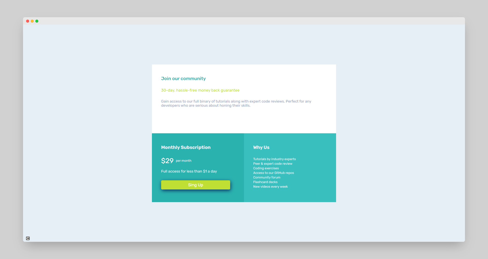
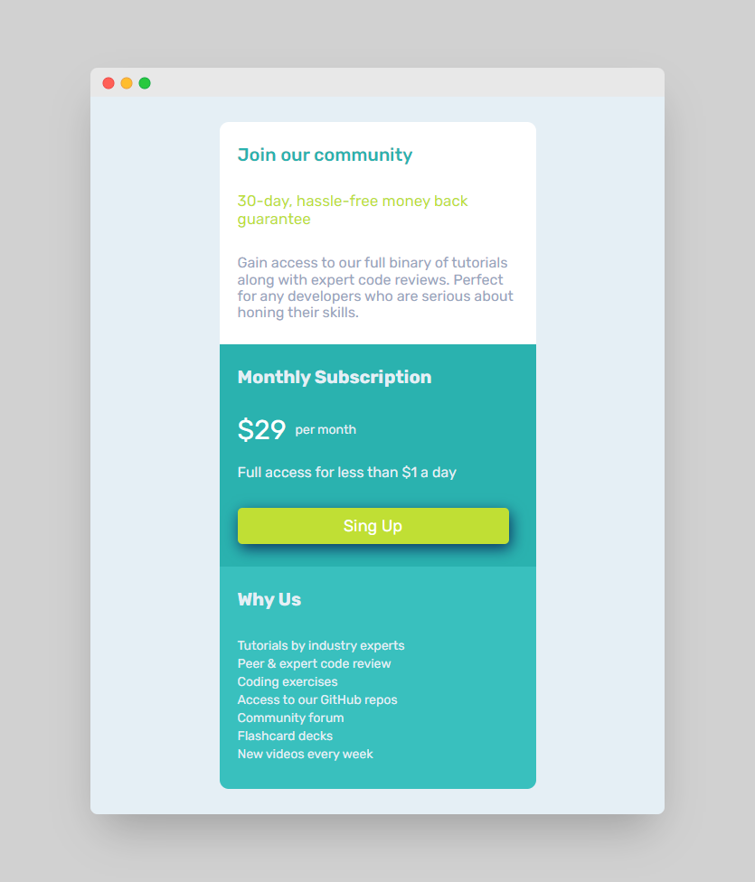

# Frontend Mentor | Single Price Grid Component
## Table of contents

- [Overview](#overview)
  - [The challenge](#the-challenge)
  - [Screenshot](#screenshot)
  - [Links](#links)
- [My process](#my-process)
  - [Built with](#built-with)
- [Author](#author)

## Overview

### The challenge

Users should be able to:

- View the optimal layout depending on their device's screen size

### Screenshot

### Links

- Live Site URL: [Live Site](https://fm-single-price-grid-component-gonzalo-gauna.netlify.app/)

## My process

### Built with

- Semantic HTML5 markup
- Flexbox
- Grid

## Author

- Frontend Mentor - [@GonzaloGauna](https://www.frontendmentor.io/profile/GonzaloGauna)
- Twitter - [@gonzalogaunaDev](https://twitter.com/gonzalogaunaDev)
